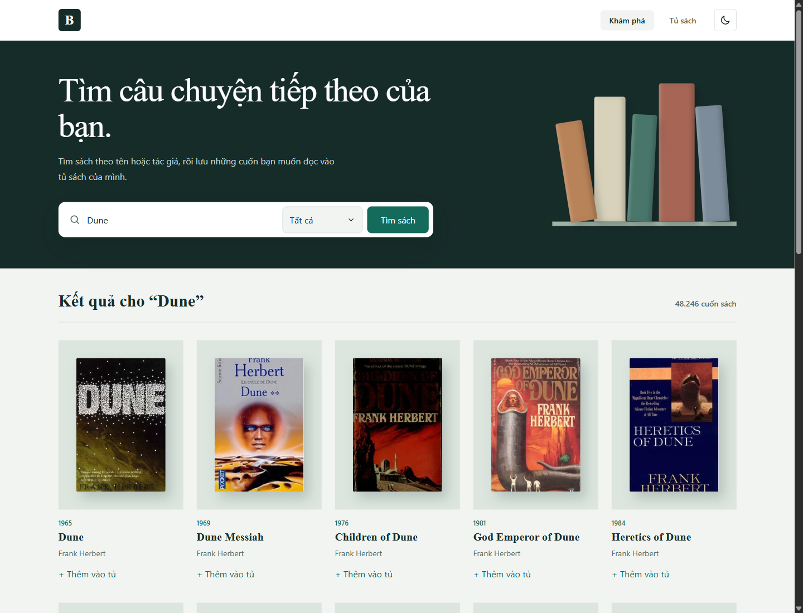
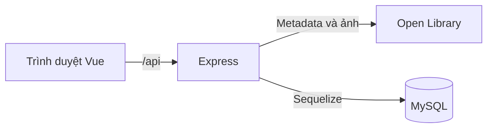
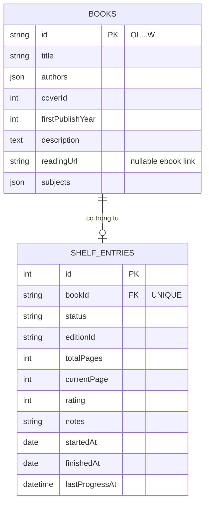

# Mini Reading Tracker

Ứng dụng một người dùng để tìm sách từ Open Library, lưu vào tủ sách MySQL và theo dõi trạng thái, tiến độ, đánh giá, ghi chú. Không cần đăng nhập; không cung cấp nội dung toàn văn để đọc sách.

- **Repository:** https://github.com/Ngoquyen07/bookmg-workspace — để công khai hoặc cấp quyền cho người chấm.
- **Frontend:** https://pentest-142.store/
- **Backend:** https://pentest-142.store/api — kiểm tra tại [/api/health](https://pentest-142.store/api/health).
- **Đề bài:** [Mini Reading Tracker](docs/README.reading-tracker.pdf).



## Công nghệ và chức năng

**FE:** Vue 3, Vue Router, Vite, Tailwind CSS 4, Axios, Vue Toastification. **BE:** Node.js 22, Express 5, Joi, dotenv. **Database:** MySQL 8, Sequelize 6, mysql2 và migration. **Triển khai:** Docker Compose, Caddy, Ubuntu VPS; mã nguồn quản lý bằng Git/GitHub.

Đã triển khai tìm theo tên/tác giả với phân trang, chi tiết sách, thêm vào tủ, ba trạng thái đọc, thống kê, tiến độ, đánh giá 1–5 sao, ghi chú và xóa có xác nhận. Có trạng thái đang tải, rỗng và lỗi. FE chỉ gọi BE; mọi dữ liệu/ảnh Open Library đi qua BE, không cần API key.

**Khác đề bài:** bỏ chọn trạng thái lúc thêm; luôn mặc định Muốn đọc và đổi sau khi thêm. Form cập nhật tiến độ/đánh giá/ghi chú nằm ở chi tiết, tủ sách dẫn tới form. Trang chủ là tổng quan thay vì tìm kiếm. Các điểm này cần được trình bày với người chấm.

**Bổ sung:** tổng quan gồm Tiếp tục đọc, Sắp đọc xong (80%–dưới 100%), Vừa hoàn thành; mỗi nhóm tối đa 4 sách mặc định. Tìm theo chủ đề, click tác giả/chủ đề từ chi tiết, phân trang tủ, sáng/tối, toast thao tác, hủy thay đổi form, xóa từ chi tiết và giữ trạng thái điều hướng. Tổng quan dùng dữ liệu MySQL, không có lịch sử đọc từng ngày.

## Chạy local

Cần Node.js >= 22.12.0, npm, Git và MySQL >= 8.0.16 đang chạy.

```powershell
git clone https://github.com/Ngoquyen07/bookmg-workspace.git
cd bookmg-workspace
git switch main
```

Tạo database bằng công cụ MySQL với tài khoản có quyền:

```sql
CREATE DATABASE IF NOT EXISTS bookmg
  CHARACTER SET utf8mb4 COLLATE utf8mb4_unicode_ci;
```

**Terminal BE**, từ thư mục gốc:

```powershell
cd bookmg-repo-be
npm ci
if (-not (Test-Path .env)) { Copy-Item .env.example .env }
```

Sửa `.env`: `BASE_URL=http://127.0.0.1:3000`, `DB_HOST=127.0.0.1`, `DB_PORT=3306`, `DB_NAME=bookmg`, `DB_USER` và `DB_PASSWORD` theo MySQL của máy. Sau đó:

```powershell
npm run db:check
npm run db:migrate
npm run dev
```

**Terminal FE**, từ thư mục gốc:

```powershell
cd bookmg-repo-fe
npm ci
if (-not (Test-Path .env)) { Copy-Item .env.example .env }
npm run dev
```

FE `.env`: `BASE_URL=http://127.0.0.1:5173`, `API_BASE_URL=http://127.0.0.1:3000`. Mở http://127.0.0.1:5173; BE tại http://127.0.0.1:3000. Không ghi đè `.env` đã có; khởi động lại sau khi sửa. Vite proxy `/api` chỉ áp dụng khi chạy dev. `npm run build` tạo bản FE production; `npm start` chạy BE không theo dõi thay đổi. Server local không tự chạy migration.

## Kiến trúc và database

FE: `src/views` chứa trang; `src/modules/{books,shelf,dashboard}` chứa API, component và logic từng chức năng; `src/components` dùng chung; `src/router` quản lý route; `src/services/api.js` là Axios client; `src/config/messageConfig.js` chứa thông báo API và nội dung tổng quan. Route: `/`, `/discover`, `/books/:workId`, `/shelf`.

BE: `server.js` kiểm tra MySQL trước khi mở cổng; `app.js` cấu hình Express. Luồng `routers → controllers → services → repositories → Sequelize/MySQL`; service gọi `adapters/openLibraryAdapter.js` cho nguồn ngoài. `config`, `constants`, `validation`, `utils` quản lý cấu hình, đầu vào, lỗi và phản hồi; `models/migrations` quản lý schema.





Hai bảng đều có `createdAt/updatedAt`. `books` lưu metadata tác phẩm và `readingUrl` tùy chọn; `shelf_entries` lưu trạng thái và phiên bản đọc. `bookId` là khóa ngoại duy nhất, một sách tối đa một bản ghi tủ. Tác giả/chủ đề là JSON; số trang thuộc phiên bản `OL...M`, chưa rõ thì `null`. Migration được theo dõi trong `SequelizeMeta`.

Chi tiết hiện mục ebook khi có link đọc/mượn khớp đúng phiên bản; không có thì ẩn cả nhãn. BE tra Read API, kiểm tra URL và lưu link ở `books` khi thêm vào tủ; mở detail không ghi DB. Nếu không gửi `editionId` lúc thêm, BE chọn phiên bản gợi ý. Link mở tab ngoài, có thể yêu cầu mượn và thay đổi khả năng truy cập; tiến độ vẫn nhập thủ công. Ví dụ: [ebook-link.http](bookmg-repo-be/requests/ebook-link.http).

Tìm kiếm/xem chi tiết không ghi database. Thêm và xóa hai bảng dùng transaction; cập nhật dùng transaction và khóa bản ghi. Thêm trùng trả 409. Trang đọc là số nguyên 0–tổng trang; bằng tổng tự Đã đọc, lớn hơn 0 và chưa hết tự Đang đọc. Lần đầu Đang đọc ghi ngày bắt đầu, chuyển Đã đọc ghi ngày hoàn thành. Đánh giá nguyên 1–5 hoặc trống; ghi chú tối đa 1.000 ký tự. Không rõ tổng trang thì không nhập tiến độ số, vẫn đổi trạng thái/đánh giá/ghi chú được. Phần trăm lấy phần nguyên xuống; `lastProgressAt` chỉ đổi khi trang thay đổi.

## API

| Phương thức | Đường dẫn | Chức năng |
| --- | --- | --- |
| GET | `/api/health` | Kiểm tra BE |
| GET | `/api/books/search` | Tìm kiếm; `q`, `field=all/title/author/subject`, `page`, `limit` |
| GET | `/api/books/:workId` | Chi tiết và phiên bản gợi ý |
| GET | `/api/books/covers/:coverId` | Ảnh JPEG qua BE |
| GET | `/api/shelf` | Tủ sách; `status`, `page`, `limit` |
| GET | `/api/shelf/stats` | Tổng và số theo trạng thái |
| GET | `/api/shelf/:bookId` | Một sách trong tủ |
| POST | `/api/shelf` | Thêm; body `{workId, editionId?}` |
| PATCH | `/api/shelf/:bookId` | Sửa `{currentPage?, status?, rating?, notes?}` |
| DELETE | `/api/shelf/:bookId` | Xóa cả bản ghi tủ và sách |
| GET | `/api/dashboard` | Thống kê và ba nhóm; `limit=1..6`, mặc định 4 |

JSON thành công: `{status, data, meta?}`; lỗi: `{status, error:{code,message}}`. `status` khớp HTTP; ảnh dùng HTTP status và JPEG. Danh sách có `count` số trả về, `total` tổng khớp; search/tủ thêm thông tin phân trang. Search mặc định 20 sách/trang, tủ 10; BE validate và giới hạn `limit` tối đa 50. Trạng thái: `want_to_read`, `reading`, `finished`.

Mã HTTP: 200 đọc/sửa/xóa, 201 thêm, 400 đầu vào sai, 404 không thấy, 409 trùng, 500 lỗi nội bộ, 502/504 lỗi/timeout nguồn. BE có `try/catch`, phản hồi thống nhất và log file `logs/YYYY-MM-DD.log` bị Git bỏ qua. Timeout nguồn 10 giây. Ví dụ chạy bằng VS Code REST Client: [books.http](bookmg-repo-be/requests/books.http), [shelf.http](bookmg-repo-be/requests/shelf.http), [luồng đầy đủ](bookmg-repo-be/requests/reading-flow.http), [dashboard.http](bookmg-repo-be/requests/dashboard.http). Đọc từng request trước khi chạy thao tác ghi/xóa.

## Triển khai

Ứng dụng dùng một Ubuntu VPS. `compose.yaml` chạy MySQL, migration, BE và Caddy; chỉ công khai 80/443. Caddy cấp HTTPS, phục vụ FE và proxy `/api` tới BE; MySQL không mở cổng public. Cần Docker/Compose, tên miền trỏ DNS tới VPS và quyền đọc repository.

Từ checkout `main` tại `/home/ubuntu/apps/bookmg`:

```sh
# Chỉ copy khi chưa có .env; điền tên miền và hai mật khẩu khác nhau.
cp deploy/env.example .env
docker compose config --quiet
docker compose up -d --build
docker compose ps
curl -f https://TEN_MIEN_CUA_BAN/api/health
```

`.env` gốc dùng `BOOKMG_DOMAIN`, `DB_PASSWORD`, `MYSQL_ROOT_PASSWORD`; không commit secrets. Compose đợi MySQL và migration thành công trước khi chạy ứng dụng; dữ liệu/log/chứng chỉ nằm trong volume.

VPS được cấu hình dùng `main` với deploy key chỉ đọc. Cài bộ hẹn giờ đồng bộ sau lần triển khai đầu:

```sh
sudo install -m 644 deploy/systemd/bookmg-deploy.service /etc/systemd/system/
sudo install -m 644 deploy/systemd/bookmg-deploy.timer /etc/systemd/system/
sudo systemctl daemon-reload
sudo systemctl enable --now bookmg-deploy.timer
```

`deploy/bookmg-sync.sh` kiểm tra khoảng mỗi phút, fast-forward `main`, rebuild và kiểm tra dịch vụ. Thất bại thì thử khôi phục code/container cũ, không rollback database; backup trước thay đổi schema. Kiểm tra bằng `git rev-parse HEAD`, `docker compose ps` và `journalctl -u bookmg-deploy.service -n 80 --no-pager`. Nhánh tính năng tích hợp vào `develop`; chỉ cập nhật `main` mới kích hoạt triển khai. GitHub Actions kiểm tra build/proxy khi push hoặc PR vào `main`.

## Kiểm thử, dữ liệu mẫu và hạn chế

Chạy từ thư mục gốc sau cài package:

```powershell
npm --prefix bookmg-repo-be test
npm --prefix bookmg-repo-fe test
npm --prefix bookmg-repo-fe run build
npm --prefix bookmg-repo-fe run check:api
npm --prefix bookmg-repo-be run db:test
```

`db:test` tạo/xóa database tạm, cần quyền CREATE/DROP DATABASE; không thay đổi tủ đang dùng. Để có dữ liệu mẫu, thêm ít nhất ba sách qua giao diện rồi đặt ở ba trạng thái, kèm tiến độ/đánh giá/ghi chú; nên có sách biết tổng trang. Chưa có seed tự động.

Open Library có thể thiếu metadata; BE chỉ gợi ý từ 50 phiên bản đầu và chi tiết vẫn phụ thuộc nguồn ngoài. Một tủ dùng chung nên người truy cập có thể sửa dữ liệu. Chưa có auth, chọn mọi phiên bản, cache metadata BE, nhật ký đọc hoặc dọn log tự động. Hướng cải thiện: seed mẫu, test MySQL trong CI, chọn phiên bản, cache và giám sát vận hành.

Trước khi nộp cần xác nhận đúng commit public, HTTPS, dữ liệu mẫu, quyền repo và thử luồng chính; duy trì VPS/tên miền ít nhất 7 ngày sau nộp. Kết quả local không chứng minh uptime hoặc trạng thái triển khai. Thiết kế chi tiết: [tổng quan](docs/features/reading-dashboard.md), [tìm chủ đề/tác giả](docs/features/subject-search.md).
