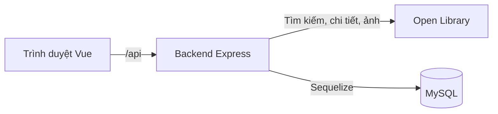
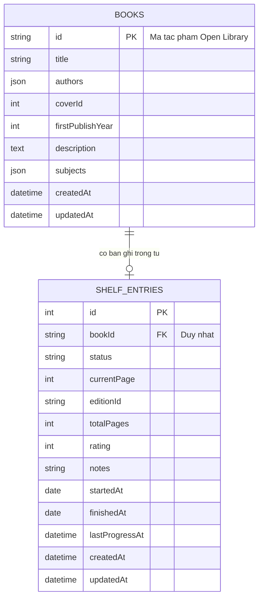

# Mini Reading Tracker

Ứng dụng dành cho một người dùng, hỗ trợ tìm sách từ Open Library, lưu vào tủ sách MySQL và theo dõi trạng thái, tiến độ, đánh giá, ghi chú. Ứng dụng theo dõi việc đọc; không cung cấp nội dung toàn văn để đọc sách trực tiếp.

- Mã nguồn: https://github.com/Ngoquyen07/bookmg-workspace — cần để công khai hoặc cấp quyền cho người chấm.
- Giao diện public: https://pentest-142.store/
- Địa chỉ gốc API public: https://pentest-142.store/api
- Kiểm tra backend: https://pentest-142.store/api/health
- Đề bài gốc: [Mini Reading Tracker — Bài test Fullstack](docs/README.reading-tracker.pdf).

README mô tả mã nguồn hiện tại trên `develop`. VPS được cấu hình đồng bộ từ `main`; tính năng trên `develop` chỉ xuất hiện ở bản public sau khi được tích hợp vào `main` và triển khai thành công. Kiểm tra local không xác nhận phiên bản đang chạy trên VPS, dữ liệu mẫu public hay thời gian hoạt động liên tục.

Ảnh màn tìm kiếm dưới đây được chụp từ ứng dụng local ngày 01/10/2026:


## Công nghệ sử dụng

| Thành phần | Công nghệ đang sử dụng |
| --- | --- |
| Giao diện | Vue 3, Vue Router, Vite, Tailwind CSS 4, Axios, Vue Toastification |
| Backend | Node.js 22, Express 5, Joi, dotenv, HTTP `fetch` có sẵn trong Node.js |
| Cơ sở dữ liệu | MySQL 8, Sequelize 6, mysql2, Sequelize CLI và migration |
| Kiểm thử | Node test runner, Supertest, Vitest, Vue Test Utils; kiểm tra trình duyệt bằng Playwright |
| Triển khai | Docker Compose, Caddy, Ubuntu VPS, bộ hẹn giờ systemd |
| Quản lý mã nguồn | Git, GitHub; GitHub Actions kiểm tra build và kết nối FE → BE |

Dự án dùng JavaScript ES modules. Một số thư viện đã được cài nhưng không đồng nghĩa tính năng tương ứng đã triển khai: hiện không có đăng nhập/JWT, phân quyền hay quản lý tủ sách theo tài khoản.

## Đối chiếu với yêu cầu đề bài

| Yêu cầu | Kết quả hiện tại |
| --- | --- |
| Frontend Vue.js, backend Node.js, database MySQL | Đã có; thao tác SQL thông qua Sequelize |
| Tìm theo tên sách hoặc tác giả | Đã có ở `/discover`, kết quả mặc định 20 sách/trang |
| Hiển thị bìa, tên, tác giả, năm xuất bản; phân trang | Đã có; thiếu dữ liệu thì hiển thị thông tin thay thế |
| Thêm từ kết quả, đánh dấu sách đã có trong tủ | Đã có; kiểm tra từ MySQL, thêm trùng trả 409 |
| Trạng thái đang tải, không có kết quả và lỗi | Đã có vòng tải, thông báo và nút thử lại |
| Chi tiết bìa, tên, tác giả, mô tả, số trang, chủ đề, năm xuất bản | Đã có khi nguồn dữ liệu cung cấp; số trang thuộc một phiên bản xuất bản |
| Chọn trạng thái ban đầu khi thêm | **Đã bỏ theo quyết định trong quá trình phát triển:** luôn thêm với trạng thái Muốn đọc |
| Ba tab Muốn đọc / Đang đọc / Đã đọc | Đã có, phân trang theo từng tab |
| Thống kê tổng sách, đang đọc, đã đọc | Đã có phía trên tủ sách |
| Tiến độ, cập nhật trang, đổi trạng thái, đánh giá 1–5 sao, ghi chú | Đã có; form cập nhật nằm ở chi tiết sách, thẻ trong tủ hiển thị dữ liệu và dẫn tới form |
| Xóa có xác nhận | Đã có ở tủ sách và chi tiết |
| Không cần đăng nhập, ứng dụng một người dùng | Đã có một tủ sách dùng chung, không có tài khoản |
| FE không gọi trực tiếp Open Library | Các request dữ liệu và ảnh đều đi qua BE |
| Validate BE, phản hồi lỗi thống nhất, ngày đọc và tự hoàn thành | Đã có; cập nhật liên quan thực hiện trong transaction |
| Deploy FE, BE, MySQL và HTTPS | Đã có cấu hình VPS/Docker/Caddy và đồng bộ `main`; MySQL chỉ truy cập trong mạng nội bộ |
| Có dữ liệu mẫu, hoạt động ít nhất 7 ngày sau nộp | Cần kiểm tra dữ liệu và vận hành bản public trước/sau nộp; chưa có lệnh tạo dữ liệu mẫu tự động |

### Những điểm khác cách tổ chức trong đề

Đề mô tả ba màn hình, trong đó tìm kiếm là trang chủ. Phiên bản hiện tại có bốn trang: tổng quan `/`, tìm kiếm `/discover`, chi tiết `/books/:workId`, tủ sách `/shelf`. Link tìm kiếm cũ ở `/` vẫn được chuyển tới `/discover`, giữ từ khóa và trang.

Đề cho chọn trạng thái ngay khi thêm. Cả FE và BE hiện chỉ cho thêm với `want_to_read`; sau khi thêm mới đổi trạng thái ở chi tiết. Đây là yêu cầu gốc đã chủ động bỏ, không phải tính năng đã hoàn thành đúng như đề.

Các thao tác cập nhật tiến độ, trạng thái, đánh giá và ghi chú được tập trung trong chi tiết. Tủ sách hiển thị tiến độ, đánh giá, ghi chú và nút đi tới chi tiết; không có form sửa trực tiếp trên từng thẻ. Các khác biệt này cần được trình bày với người chấm.

### Tính năng bổ sung ngoài yêu cầu tối thiểu

| Tính năng | Hành vi và phạm vi |
| --- | --- |
| Trang tổng quan | Bốn số thống kê và ba nhóm Tiếp tục đọc, Sắp đọc xong, Vừa hoàn thành |
| Tiếp tục đọc | Chỉ sách Đang đọc; ưu tiên lần thay đổi số trang gần nhất, sau đó dùng ngày bắt đầu/ngày thêm khi chưa có lịch sử |
| Sắp đọc xong | Sách Đang đọc có số trang xác định, tiến độ từ 80% đến dưới 100%; ưu tiên tiến độ cao nhất |
| Vừa hoàn thành | Sách Đã đọc, sắp theo ngày hoàn thành gần nhất |
| Giới hạn tổng quan | Mỗi nhóm mặc định tối đa 4 sách, API cho phép 1–6; số thống kê và tổng khớp điều kiện không bị giới hạn. Mở tủ sách để xem đầy đủ |
| Tìm theo chủ đề | Chọn Chủ đề trong tìm kiếm hoặc click chủ đề ở chi tiết; tìm toàn bộ Open Library, không tìm riêng trong tủ |
| Click tác giả | Mỗi tên tác giả ở chi tiết dẫn tới tìm kiếm theo tác giả; nhiều tác giả có link riêng |
| Phân trang tủ sách | Mặc định 10 sách/trang theo trạng thái; đổi trang cuộn về đầu trang |
| Giao diện sáng/tối | Lưu lựa chọn trên trình duyệt; logo và favicon dùng biểu tượng sách |
| Thông báo thao tác | Thông báo khi thêm, cập nhật, xóa; lỗi thao tác cũng có thông báo |
| Quản lý thay đổi form | Lưu chỉ được bật khi dữ liệu thay đổi; Hủy khôi phục dữ liệu ban đầu; lỗi nhập liệu nằm dưới trường tương ứng |
| Xóa từ chi tiết | Có hộp xác nhận; thành công quay về màn trước đó |
| Điều hướng | Giữ từ khóa/trang tìm kiếm và tab tủ sách khi quay lại; URL chi tiết không cần tham số chỉ nguồn truy cập |
| Đồng bộ triển khai | VPS kiểm tra `main` định kỳ; nhánh phát triển không tự triển khai |

Tổng quan và tìm theo chủ đề dùng API hiện có/SQL có giới hạn, không thêm bảng tài khoản hoặc bảng dashboard. `lastProgressAt` chỉ thay đổi khi số trang thực sự thay đổi; sửa đánh giá/ghi chú không làm sách nhảy lên đầu nhóm Tiếp tục đọc. Đây không phải nhật ký đọc từng ngày.

Tài liệu thiết kế kỹ thuật bằng tiếng Anh được giữ riêng: [tổng quan](docs/features/reading-dashboard.md), [tìm theo chủ đề và tác giả](docs/features/subject-search.md).

## Chạy trên máy local

Cần Node.js >= 22.12.0, npm, Git và MySQL >= 8.0.16 đang chạy. MySQL từ phiên bản này thực thi các ràng buộc CHECK dùng trong migration.

```powershell
git clone https://github.com/Ngoquyen07/bookmg-workspace.git
cd bookmg-workspace
git switch develop
```

Tạo database bằng MySQL Shell ở chế độ SQL, Workbench hoặc công cụ SQL khác. Tài khoản chạy lệnh cần quyền tạo database:

```sql
CREATE DATABASE IF NOT EXISTS bookmg
  CHARACTER SET utf8mb4 COLLATE utf8mb4_unicode_ci;
```

Mở hai terminal tại thư mục vừa clone. Không ghi đè `.env` đã cấu hình.

### Backend

```powershell
cd bookmg-repo-be
npm ci
if (-not (Test-Path .env)) { Copy-Item .env.example .env }
```

Sửa `bookmg-repo-be/.env` bằng thông tin MySQL của máy:

```dotenv
BASE_URL=http://127.0.0.1:3000
DB_HOST=127.0.0.1
DB_PORT=3306
DB_NAME=bookmg
DB_USER=root
DB_PASSWORD=mat_khau_mysql_cua_ban
```

Sau đó kiểm tra kết nối, chạy migration rồi khởi động:

```powershell
npm run db:check
npm run db:migrate
npm run db:migrate:status
npm run dev
```

Backend mặc định chạy tại http://127.0.0.1:3000. `/api/health` trả `{"status":200,"data":{"status":"ok"}}`. Lệnh `db:check` chỉ xác nhận kết nối; không thay thế kiểm thử nghiệp vụ. Chạy server local không tự tạo database hoặc tự chạy migration.

### Frontend

```powershell
cd bookmg-repo-fe
npm ci
if (-not (Test-Path .env)) { Copy-Item .env.example .env }
npm run dev
```

Cấu hình mặc định trong `bookmg-repo-fe/.env`:

```dotenv
BASE_URL=http://127.0.0.1:5173
API_BASE_URL=http://127.0.0.1:3000
```

Mở http://127.0.0.1:5173. `API_BASE_URL` phải trỏ tới `BASE_URL` của backend. Vite chuyển request `/api` tới BE trong môi trường dev; trình duyệt vẫn gọi đường dẫn tương đối bằng Axios. Sau khi sửa `.env`, khởi động lại server tương ứng. Open Library không yêu cầu API key.

### Build và chạy thông thường

- Trong FE, `npm run build` tạo `dist/`; `npm run preview` xem bản build nhưng không có cấu hình proxy `/api` như dev. Dùng `npm run dev` để kiểm tra ứng dụng tích hợp local hoặc phục vụ bản build qua Caddy.
- Trong BE, `npm start` chạy server không bật chế độ theo dõi thay đổi.
- Trong FE, `npm run check:api` kiểm tra proxy với hai cổng thử nghiệm 15173 và 13000.
- `.env`, `node_modules`, bản build và log không được commit. Hai thư mục FE/BE thuộc cùng một repository Git tại workspace.

## Kiến trúc và luồng xử lý



### Frontend

| Thư mục/tệp | Trách nhiệm |
| --- | --- |
| `src/views` | Bốn trang chính: tổng quan, khám phá, chi tiết, tủ sách |
| `src/modules/books` | API sách, form tìm/thêm sách, thẻ sách, kiểm tra đầu vào |
| `src/modules/shelf` | API tủ sách, thẻ trong tủ, form cập nhật, kiểm tra đầu vào |
| `src/modules/dashboard` | API tổng quan, composable tải dữ liệu, thống kê và các nhóm sách |
| `src/components` | Thành phần dùng chung: header, bìa sách, phân trang, lựa chọn, hộp xác nhận |
| `src/services/api.js` | Axios client chung, xử lý phản hồi/lỗi API |
| `src/config/messageConfig.js` | Thông báo lỗi API và cấu hình nội dung tổng quan |
| `src/router` | Route, chuyển hướng và cuộn trang |

Luồng gọi dữ liệu: trang → API của module → Axios chung → `/api` → BE. Component nhận dữ liệu qua props và phát sự kiện cho thao tác người dùng. Tìm kiếm giữ từ khóa, chế độ và trang trong URL; tab tủ sách dùng trạng thái điều hướng. Không cần tài khoản hoặc kho trạng thái toàn cục cho phạm vi hiện tại.

### Backend

Luồng chính: router → controller → service → repository → Sequelize/MySQL. Với dữ liệu Open Library, service gọi adapter thay vì repository SQL.

| Thư mục/tệp | Trách nhiệm |
| --- | --- |
| `app.js` | Cấu hình Express, phân tích request, gắn route và xử lý lỗi HTTP |
| `server.js` | Kiểm tra kết nối MySQL trước khi mở cổng, quản lý khởi động/tắt server |
| `config` | dotenv và kết nối Sequelize dùng chung |
| `routers`, `controllers` | Định tuyến, validate, gọi service và trả HTTP response |
| `services` | Quy tắc nghiệp vụ, chuẩn hóa dữ liệu, điều phối thao tác |
| `repositories` | Query ORM, transaction và khóa bản ghi |
| `adapters/openLibraryAdapter.js` | Gọi API nguồn, timeout và chuẩn hóa metadata |
| `models`, `migrations` | Khai báo thực thể/quan hệ và thay đổi schema có phiên bản |
| `constants`, `validation`, `utils` | Hằng số, Joi, lỗi ứng dụng và hàm trả response |
| `services/core` | Ghi log |
| `requests`, `test`, `scripts` | Ví dụ HTTP và các kiểm tra chạy được |

`config/env.js` đọc `.env` của BE không phụ thuộc thư mục terminal, giữ ưu tiên cho biến môi trường đã được cấp từ hệ điều hành/container. Không dùng `sync({ force: true })` khi khởi động.

## Thiết kế cơ sở dữ liệu



`books` lưu thông tin tác phẩm: mã `OL...W`, tên, tác giả, bìa, năm xuất bản lần đầu, mô tả và chủ đề. Tác giả/chủ đề là mảng JSON, không có bảng tác giả riêng.

`shelf_entries` lưu việc thêm vào tủ và trạng thái đọc. `bookId` là khóa ngoại duy nhất: một tác phẩm có tối đa một bản ghi trong tủ dùng chung. `editionId` (`OL...M`) và `totalPages` đặt ở đây vì số trang thuộc phiên bản được chọn. Số trang không rõ là `null`, không dùng 0. Ghi chú tối đa 1.000 ký tự; đánh giá là số nguyên 1–5 hoặc `null`.

Quan hệ được đăng ký qua `models/index.js`. Khóa ngoại ngăn xóa sách khi bản ghi tủ vẫn tồn tại. Thêm lưu hai bảng trong một transaction; xóa lần lượt bản ghi tủ và sách trong một transaction; lỗi ở một bước sẽ rollback cả thao tác. Thêm lại sau khi xóa tạo lại dữ liệu ở cả hai bảng. Tìm kiếm hoặc xem chi tiết không tạo bản ghi sách.

Migration lưu lịch sử schema và được chạy qua `npm run db:migrate`; `npm run db:migrate:status` xem trạng thái. Ngoài hai bảng nghiệp vụ, Sequelize CLI dùng bảng `SequelizeMeta` để ghi migration đã áp dụng. Khi thêm cột/bảng, tạo migration mới, cập nhật model liên quan và chạy migration, không sửa lịch sử đã chạy để đồng bộ một cách ngầm định.

## API và quy tắc nghiệp vụ

### Danh sách endpoint

| Phương thức | Đường dẫn | Chức năng |
| --- | --- | --- |
| GET | `/api/health` | Kiểm tra backend đang trả lời |
| GET | `/api/dashboard` | Thống kê và ba nhóm sách tổng quan |
| GET | `/api/books/search` | Tìm sách theo tất cả, tên, tác giả hoặc chủ đề |
| GET | `/api/books/:workId` | Chi tiết tác phẩm và phiên bản gợi ý |
| GET | `/api/books/covers/:coverId` | Trả ảnh bìa JPEG thông qua BE |
| GET | `/api/shelf` | Xem tủ sách, lọc và phân trang |
| GET | `/api/shelf/stats` | Đếm sách theo trạng thái |
| GET | `/api/shelf/:bookId` | Xem một sách đã lưu |
| POST | `/api/shelf` | Thêm vào tủ với trạng thái Muốn đọc |
| PATCH | `/api/shelf/:bookId` | Cập nhật tiến độ, trạng thái, đánh giá, ghi chú |
| DELETE | `/api/shelf/:bookId` | Xóa khỏi tủ và xóa thông tin sách |

### Định dạng phản hồi

JSON thành công dùng `status` và `data`; danh sách thêm `meta`. Lỗi có mã ổn định trong `error.code` và thông báo trong `error.message`. `status` dạng số khớp mã HTTP; ảnh bìa là JPEG nên chỉ có HTTP status, không bọc JSON.

```json
{
  "status": 200,
  "data": [],
  "meta": { "page": 1, "limit": 20, "count": 0, "total": 0, "totalPages": 0 }
}
```

`count` là số phần tử trả về, `total` là tổng số khớp điều kiện, `totalPages` là số trang. Ví dụ trên là kết quả tìm kiếm rỗng.

```json
{
  "status": 400,
  "error": { "code": "VALIDATION_ERROR", "message": "Thông báo lỗi của API" }
}
```

Các mã HTTP chính: 200 đọc/cập nhật/xóa, 201 thêm thành công, 400 dữ liệu sai, 404 không tìm thấy, 409 sách đã có trong tủ, 500 lỗi nội bộ, 502 lỗi dữ liệu/kết nối Open Library, 504 nguồn phản hồi quá thời hạn.

### Tìm kiếm và chi tiết

`GET /api/books/search?q=Harry%20Potter&field=all&page=1&limit=20`:

- `q`: bắt buộc, sau bỏ khoảng trắng đầu/cuối dài 1–200 ký tự.
- `field`: `all`, `title`, `author`, `subject`; mặc định `all`.
- `page`: số nguyên 1–10.000; mặc định 1.
- `limit`: số nguyên 1–50; mặc định 20.

Mỗi kết quả có `id`, `title`, `authors`, `coverId`, `coverUrl`, `firstPublishYear`, `isInShelf`. Tác giả thiếu thành `[]`, bìa/năm thiếu thành `null`. Mã tác phẩm lấy từ `key` của Open Library; `coverId` chỉ nhận diện ảnh, không phải mã tác phẩm. Thông tin đã thêm được kiểm tra trong một lượt đọc MySQL cho danh sách kết quả.

Tìm chủ đề dùng biểu thức `subject:"..."` qua Search API, xử lý dấu nháy và dấu gạch chéo ngược trước khi mã hóa URL. Click chủ đề hoặc tác giả ở chi tiết mở tìm kiếm tương ứng, trang 1; đổi trang giữ chế độ đó. Kết quả phụ thuộc cách Open Library lập chỉ mục, không cam kết khớp chính xác toàn bộ hệ thống phân loại chủ đề.

`GET /api/books/:workId` đọc metadata tác phẩm từ Open Library. Nếu đã lưu vào tủ, mã phiên bản và số trang lấy từ bản ghi tủ; nếu chưa, BE xem 50 phiên bản đầu và gợi ý phiên bản đầu có số trang hợp lệ. Không tìm thấy thì cả `editionId`/`totalPages` là `null`. Năm ở search và năm trong tác phẩm có thể khác nhau vì nguồn trả metadata khác nhau.

BE gọi thêm API tác giả, phiên bản hoặc danh sách phiên bản khi cần lấy tên tác giả/số trang. FE không gọi trực tiếp các API này. Request nguồn có thời hạn 10 giây, kể cả lúc đọc nội dung response. Ảnh trả qua `/api/books/covers/:coverId` và được cache trình duyệt một ngày; lỗi ảnh có hình thay thế trên FE. Chưa có cache kết quả search phía BE hoặc tự thử lại request nguồn.

### Thêm và đọc tủ sách

Ví dụ body `POST /api/shelf`:

```json
{"workId":"OL82563W","editionId":"OL62514708M"}
```

`workId` bắt buộc; `editionId` tùy chọn và phải thuộc tác phẩm. Không gửi phiên bản thì số trang lưu là `null`. FE hiện lấy phiên bản gợi ý từ chi tiết trước khi thêm. BE lấy metadata trước khi bắt đầu transaction, sau đó lưu sách và bản ghi tủ; kết quả 201 có `data.book`/`data.shelfEntry`. Thêm trùng trả 409. Không nhận trạng thái ban đầu từ request.

`GET /api/shelf?status=reading&page=1&limit=10` trả sách mới thêm trước. `status` có thể bỏ qua hoặc là `want_to_read`, `reading`, `finished`; `page` 1–10.000; `limit` 1–50, mặc định 10. Mỗi phần tử gồm `book`, `shelfEntry`, `progressPercent`. Phần trăm dùng phần nguyên xuống: 99,9% hiển thị 99%; không rõ tổng trang thì trả `null`. `GET /api/shelf/:bookId` dùng cùng cấu trúc cho một sách, không có thì 404.

`GET /api/shelf/stats` trả `total`, `wantToRead`, `reading`, `finished`. Các API đọc tủ/thống kê chỉ dùng MySQL, không cần metadata từ Open Library. Tham số không được hỗ trợ bị từ chối với 400.

### Cập nhật, ngày đọc và xóa

`PATCH /api/shelf/:bookId` nhận ít nhất một trường:

| Trường | Giá trị được nhận |
| --- | --- |
| `currentPage` | Số nguyên từ 0 đến tổng trang đã biết |
| `status` | `want_to_read`, `reading`, `finished` |
| `rating` | Số nguyên 1–5 hoặc `null` để bỏ đánh giá |
| `notes` | Chuỗi tối đa 1.000 ký tự, hoặc `null` để xóa ghi chú |

BE không nhận trường ngoài danh sách; body rỗng hoặc sai kiểu trả 400. FE hiển thị lỗi nhập liệu tại trường; BE vẫn kiểm soát lại mọi request. Tổng trang chưa biết thì FE vô hiệu hóa nhập trang, BE từ chối cập nhật `currentPage`; vẫn đổi trạng thái, đánh giá, ghi chú được.

Trang lớn hơn 0 nhưng chưa hết sách tự chuyển sang Đang đọc; bằng tổng trang tự chuyển Đã đọc. Chọn Đã đọc không kèm trang sẽ đặt trang bằng tổng nếu đã biết; gửi kèm trang thấp hơn tổng trả 400. Giảm trang của sách đã hoàn thành có thể chuyển lại Đang đọc và xóa ngày hoàn thành. Lần đầu chuyển Đang đọc ghi `startedAt`; chuyển Đã đọc ghi `finishedAt`. Ngày bắt đầu được giữ lại. Sách không rõ tổng vẫn có thể được đánh dấu Đã đọc thủ công, không tính phần trăm.

Cập nhật dùng transaction và khóa bản ghi để tiến độ, trạng thái, ngày đọc nhất quán. `lastProgressAt` do server đặt khi trang thực sự thay đổi; client không được ghi trường này.

`DELETE /api/shelf/:bookId` xóa cả bản ghi tủ và sách trong transaction, trả `{"status":200,"data":{"bookId":"OL...W","removed":true}}`. FE hỏi xác nhận trước khi gọi. Cập nhật/xóa sách không nằm trong tủ trả 404 `SHELF_ENTRY_NOT_FOUND`.

### API tổng quan

`GET /api/dashboard?limit=4` trả `stats`, `continueReading`, `nearlyFinished`, `recentlyFinished` trong `data`. Mỗi nhóm có `data` và `meta: {count,total,limit}`; giới hạn số nguyên 1–6, mặc định 4. Tổng số và giới hạn được xử lý trong MySQL. Một sách có thể xuất hiện đồng thời ở Tiếp tục đọc và Sắp đọc xong.

Nhóm Sắp đọc xong dùng tỷ lệ chính xác trong SQL, không dùng phần trăm hiển thị đã làm tròn xuống. Bản ghi cũ giữ `lastProgressAt = null` vì không thể suy ngược thời gian đọc từ `updatedAt`. Sửa ghi chú/đánh giá không đổi thứ tự hoạt động. Danh sách và thống kê là các truy vấn đọc thông thường, không phải ảnh chụp database trong một transaction duy nhất. Mở/quay lại tổng quan sẽ tải dữ liệu; khi lỗi có nút Thử lại.

## Bắt lỗi và ghi log

Controller, service, repository và adapter dùng `try/catch` tại các thao tác cần bắt lỗi. Service/repository ghi lỗi rồi ném lại; controller trả response thống nhất bằng `sendSuccess`/`sendError`. Không dùng middleware lỗi toàn cục riêng. Lỗi cấu hình/kết nối MySQL được bắt trước khi server mở cổng.

`logger.logError(error, operation, req)` gom việc ghi lỗi thành một lời gọi; cùng lỗi đi qua nhiều lớp không bị ghi lặp. `constants/responseConstants.js` và `constants/logConstants.js` quản lý mã phản hồi/thông báo vận hành. Lỗi nội bộ trả thông báo chung, không gửi stack hoặc SQL cho FE.

Log in ra terminal và lưu bất đồng bộ tại `bookmg-repo-be/logs/YYYY-MM-DD.log` dưới dạng JSON, thời gian UTC. Có log khởi động/tắt, request hoàn tất và lỗi. Không ghi body/header/query của request; các trường nhạy cảm trong ngữ cảnh được che. Thư mục log bị Git bỏ qua. Chưa có chính sách tự xóa file log cũ.

## Kiểm thử và dữ liệu mẫu

Chạy tại thư mục gốc sau khi cài package:

```powershell
# Kiểm tra BE với nguồn HTTP và các ranh giới database được giả lập
npm --prefix bookmg-repo-be test
# Kiểm tra đầu vào, component và điều hướng FE
npm --prefix bookmg-repo-fe test
npm --prefix bookmg-repo-fe run build
npm --prefix bookmg-repo-fe run check:api
# Kiểm tra kết nối database thực đã cấu hình
npm --prefix bookmg-repo-be run db:check
# Kiểm tra migration, ràng buộc, transaction trên database tạm
npm --prefix bookmg-repo-be run db:test
```

`db:test` tạo database tên ngẫu nhiên rồi xóa khi xong; tài khoản cần quyền CREATE/DROP DATABASE. Không ghi dữ liệu vào tủ sách đang dùng và không tạo dữ liệu mẫu trên demo. Bộ kiểm tra MySQL bao gồm thêm/xóa, rollback, giới hạn tiến độ, quan hệ, migration và truy vấn tổng quan.

Kết quả kiểm tra local gần nhất cho tính năng chủ đề/tác giả: 23 test BE, 9 test FE, build và proxy đạt. Luồng click chủ đề → tìm kiếm → trang tiếp theo được kiểm tra chỉ đọc bằng Edge trên local. Kết quả đó không thay thế kiểm tra GitHub CI hoặc phiên bản public.

Có thể thử API bằng REST Client trong VS Code; mở file và bấm **Send Request**. Sửa `baseUrl` cho đúng BE đang thử:

- [books.http](bookmg-repo-be/requests/books.http): tìm kiếm, chủ đề, chi tiết và ảnh.
- [shelf.http](bookmg-repo-be/requests/shelf.http): đọc, thống kê, thêm, sửa, xóa.
- [reading-flow.http](bookmg-repo-be/requests/reading-flow.http): luồng mẫu đầy đủ.
- [dashboard.http](bookmg-repo-be/requests/dashboard.http): tổng quan và giới hạn.

File tủ sách/luồng mẫu có thao tác ghi; chạy từng request sau khi đọc nội dung. Không chạy cả luồng xóa lên demo một cách vô ý.

Để chuẩn bị dữ liệu cho người chấm, tìm The Hobbit, xem phiên bản/số trang rồi thêm; thêm hai tác phẩm khác để có sách ở cả ba trạng thái. Sửa ở chi tiết để một sách Đang đọc, một sách Đã đọc; có thể thêm đánh giá/ghi chú. Nên có ít nhất một sách biết tổng trang để thử tiến độ. Dữ liệu Open Library có thể thay đổi; kiểm tra lại phiên bản, không giả định mọi sách đều có đủ thông tin. Tải lại tủ để xác nhận đã lưu. Chưa có lệnh seed tự động.

## Triển khai trên VPS

Cấu hình trong `compose.yaml` chạy MySQL, tác vụ migration, Express và Caddy trên Ubuntu VPS. Caddy phục vụ bản Vue đã build, chuyển `/api/*` tới BE và trả `index.html` cho các route FE. Chỉ cổng web 80/443 được công khai; cổng MySQL/BE không được xuất ra ngoài. HTTPS được cấp cho tên miền trong `BOOKMG_DOMAIN`.

Cần Docker Engine/Compose, tên miền trỏ DNS tới VPS, quyền truy cập GitHub của máy chủ và cổng 80/443 được mở. Với máy mới:

```sh
git clone https://github.com/Ngoquyen07/bookmg-workspace.git /home/ubuntu/apps/bookmg
cd /home/ubuntu/apps/bookmg
git switch main
# Chỉ copy khi chưa có .env; sửa tên miền và hai mật khẩu khác nhau.
cp deploy/env.example .env
docker compose config --quiet
docker compose up -d --build
docker compose ps
curl -f https://TEN_MIEN_CUA_BAN/api/health
```

`.env` gốc dùng cho Docker, khác `.env` local trong từng thư mục FE/BE. Điền `BOOKMG_DOMAIN`, `DB_PASSWORD`, `MYSQL_ROOT_PASSWORD`, không commit thông tin thật. Compose đợi MySQL sẵn sàng, chạy migration thành công rồi mới khởi động BE và web. Database, log BE và chứng chỉ Caddy có volume riêng. Thêm dữ liệu mẫu sau lần triển khai mới.

### Đồng bộ GitHub → VPS

Theo cấu hình dự án, checkout nằm tại `/home/ubuntu/apps/bookmg`, dùng nhánh `main` và deploy key chỉ đọc. Bộ hẹn giờ kiểm tra nhánh khoảng một phút/lần. Cài bộ hẹn giờ sau khi triển khai ban đầu:

```sh
sudo install -m 644 deploy/systemd/bookmg-deploy.service /etc/systemd/system/
sudo install -m 644 deploy/systemd/bookmg-deploy.timer /etc/systemd/system/
sudo systemctl daemon-reload
sudo systemctl enable --now bookmg-deploy.timer
```

`deploy/bookmg-sync.sh` chỉ cập nhật khi lịch sử cho phép fast-forward và checkout không có thay đổi được Git theo dõi. Nó rebuild container rồi kiểm tra kết nối database, API và giao diện qua HTTPS local. Nếu thất bại, script thử khôi phục mã/container cũ; không tự rollback migration hoặc dữ liệu database. Cần backup MySQL và xem tính tương thích schema trước khi triển khai thay đổi schema. `docker compose down -v` xóa volume dữ liệu.

Kiểm tra commit đang chạy và log bộ hẹn giờ:

```sh
cd /home/ubuntu/apps/bookmg
git status --short --branch
git rev-parse HEAD
systemctl status bookmg-deploy.timer
journalctl -u bookmg-deploy.service -n 80 --no-pager
```

Địa chỉ FE public là `https://TEN_MIEN/`, API là `https://TEN_MIEN/api`, kiểm tra BE tại `/api/health`. Việc cùng dùng một tên miền giúp FE tiếp tục gọi `/api` tương đối. Đẩy `develop` lên remote không triển khai lên VPS; phải tích hợp bản được duyệt vào `main`.

## Quy trình Git và kiểm tra CI

`develop` là nhánh tích hợp phát triển. Nhánh tính năng/sửa lỗi được tích hợp vào đây; phát hành sang `main` là bước riêng. Dùng thông điệp Conventional Commits và PR hướng tới `main` khi chuẩn bị phát hành. Quy tắc cho agent nằm trong `AGENTS.md` và `.agents/skills/bookmg-git-workflow/SKILL.md`.

GitHub Actions hiện chạy build FE và kiểm tra proxy FE → BE trên Node 22 khi push `main` hoặc tạo PR vào `main`. Tên kiểm tra là `Build and API checks`. Workflow chưa chạy toàn bộ test BE/FE hoặc MySQL tích hợp. Quy tắc bảo vệ nhánh phải cấu hình trên GitHub; file workflow không tự áp đặt việc bảo vệ.

## Giả định, hạn chế và hướng cải thiện

- Một tủ sách dùng chung, không có đăng nhập. Người truy cập demo có thể sửa dữ liệu chung.
- Chưa hỗ trợ chọn trạng thái lúc thêm; khác biệt này đã ghi rõ ở phần đối chiếu đề bài.
- Open Library không đảm bảo bìa, tác giả, năm hay số trang đầy đủ. Mỗi phiên bản có thể khác số trang; hiện chỉ gợi ý từ 50 phiên bản đầu, chưa có giao diện chọn mọi phiên bản.
- Chi tiết cần nguồn Open Library ngay cả khi sách đã lưu; lỗi nguồn có thể ảnh hưởng màn chi tiết. Tủ/thống kê/tổng quan đọc metadata đã lưu trong MySQL.
- Không đọc nội dung toàn văn trên ứng dụng, không có lịch sử số trang từng ngày, mục tiêu đọc hoặc phân quyền.
- Chưa có seed mẫu tự động, cache metadata/search BE, chính sách dọn log hoặc test MySQL trong CI.
- Khả năng hoạt động liên tục ít nhất 7 ngày sau nộp phụ thuộc vận hành VPS, tên miền và container; source code không chứng minh được điều này.
- Có thêm thời gian: tự động hóa dữ liệu mẫu và kiểm thử MySQL trong CI, bổ sung chọn phiên bản sách, cache nguồn và giám sát vận hành. Nếu thêm tài khoản phải thiết kế ownership và uniqueness theo người dùng.

## Trước khi nộp bài

Cấp quyền repository, gửi link FE/BE, xác nhận commit trên VPS đúng bản nộp và migration đã chạy. Kiểm tra HTTPS, có dữ liệu mẫu xem ngay và thử luồng tìm → chi tiết → thêm → sửa → xóa có xác nhận trên bản phát hành. Kiểm tra thêm trùng trả 409 và dữ liệu sai bị từ chối. Trình bày các điểm khác đề/tính năng bổ sung ở trên; giữ dịch vụ hoạt động và theo dõi ít nhất 7 ngày sau khi nộp.
