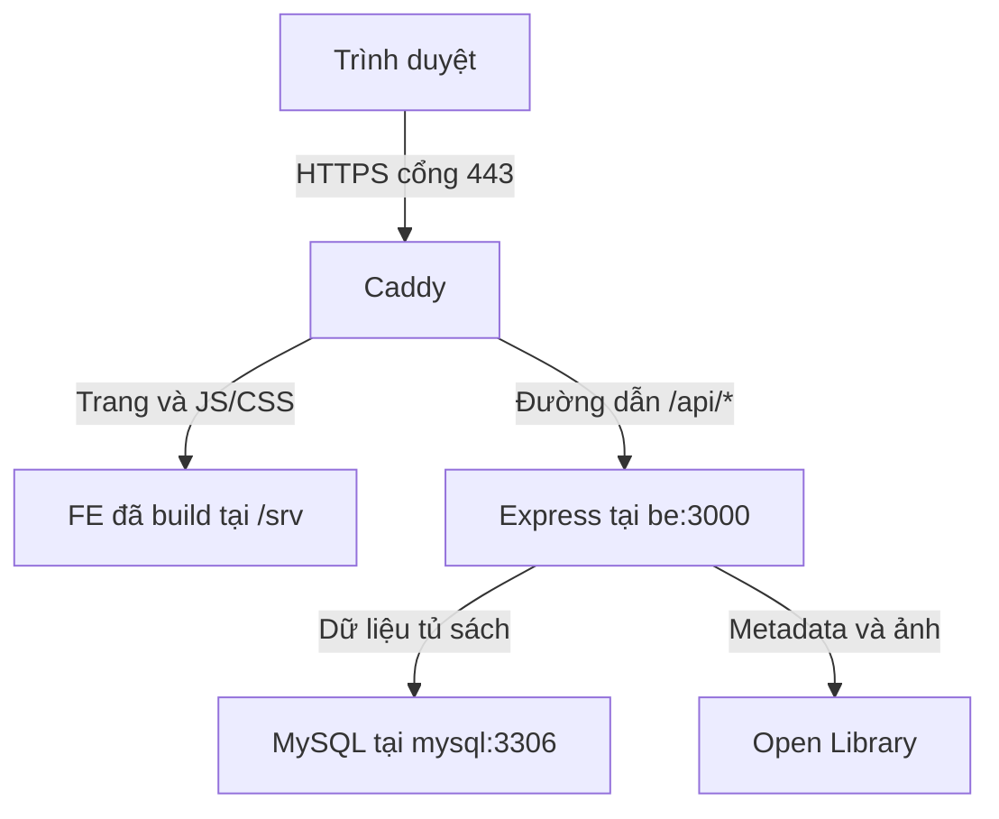

# Hiểu và vận hành deploy BookMG

Tài liệu giải thích cấu hình thực tế trong repository. Lệnh PowerShell chạy trên Windows; lệnh Bash chạy trên VPS Ubuntu sau khi SSH. Đây là tài liệu hướng dẫn, không phải thông báo các thay đổi mới đã được deploy.

## 1. Deploy là gì?

Deploy là đưa một phiên bản code lên server, cài dependency, build FE, cập nhật database khi cần, chạy ứng dụng và kiểm tra người dùng truy cập được.

Project hiện dùng AWS EC2 Ubuntu:

- Website: https://pentest-142.store/
- API: https://pentest-142.store/api
- Code trên VPS: `/home/ubuntu/apps/bookmg`.
- Nhánh deploy: `main`; `develop` dùng tích hợp tính năng.

```mermaid
flowchart LR
    Local[Code local] --> Feature[Nhánh tính năng]
    Feature --> Develop[develop]
    Develop --> PR[PR vào main]
    PR --> CI[GitHub Actions kiểm tra]
    CI --> Main[Merge main]
    Main --> Timer[VPS timer fetch main]
    Timer --> Deploy[Build Docker và migration]
    Deploy --> Check[Kiểm tra dịch vụ]
    Check --> Public[Website public cập nhật]
```



Push `develop` không cập nhật website public. GitHub Actions hiện kiểm tra code; VPS tự deploy bằng systemd timer, không phải Actions SSH vào VPS.

## 2. Các thành phần và vai trò

| Thành phần | Làm gì? |
| --- | --- |
| Ubuntu VPS | Máy chạy toàn bộ ứng dụng |
| Git checkout | Bản sao code dùng để build |
| Docker image | Bản đóng gói code và môi trường chạy |
| Container | Tiến trình đang chạy từ image |
| Docker Compose | Khai báo và vận hành các service |
| MySQL | Lưu sách, tủ sách và lịch sử migration |
| BE | Node.js/Express xử lý API |
| Caddy | Phục vụ FE, xử lý HTTPS, proxy API |
| systemd timer | Định kỳ gọi script đồng bộ main |
| GitHub Actions | Kiểm tra code trên GitHub |

Image giống một bản đóng gói; container là một lần chạy bản đó. Thay container không đồng nghĩa xóa dữ liệu trong volume.

## 3. Request đi từ trình duyệt tới đâu?



Ví dụ `/api/shelf`: Caddy chuyển request tới BE; BE đọc MySQL rồi trả JSON. Trình duyệt không cần biết địa chỉ container.

`be` và `mysql` là tên service, được Docker phân giải trong mạng Compose. Trong container BE, `localhost` là chính BE; `DB_HOST=mysql` mới trỏ tới database.

## 4. Local và production khác nhau thế nào?

| | Local | Production |
| --- | --- | --- |
| FE | Vite dev server, cổng 5173 | File đã build, Caddy phục vụ |
| BE | `npm run dev` → nodemon | `npm start` → `node server.js` |
| Khi sửa file | Nodemon theo dõi và restart | Không theo dõi code local |
| Proxy `/api` | Vite proxy | Caddy reverse proxy |
| Khi tiến trình thoát | Watcher chờ sửa file hoặc `rs` | Docker quản lý restart |
| Cập nhật phiên bản | Lưu file | Merge main, VPS build lại |

Cả local và production đều chạy `server.js`. Production không chạy `npm run dev` và không tự thấy các file mày vừa sửa ở local.

## 5. Những file cấu hình cần biết

| File | Vai trò |
| --- | --- |
| [compose.yaml](../compose.yaml) | Service, volume, healthcheck và thứ tự chạy |
| [BE Dockerfile](../bookmg-repo-be/Dockerfile) | Đóng gói BE và Node.js |
| [FE Dockerfile](../bookmg-repo-fe/Dockerfile) | Build Vue rồi đóng gói Caddy |
| [Caddyfile](../bookmg-repo-fe/Caddyfile) | HTTPS, FE và proxy API |
| [env.example](../deploy/env.example) | Mẫu biến môi trường production |
| [bookmg-sync.sh](../deploy/bookmg-sync.sh) | Đồng bộ main, deploy và thử rollback |
| [bookmg-deploy.service](../deploy/systemd/bookmg-deploy.service) | Cách systemd chạy script |
| [bookmg-deploy.timer](../deploy/systemd/bookmg-deploy.timer) | Lịch kiểm tra cập nhật |
| [ci.yml](../.github/workflows/ci.yml) | Kiểm tra trên GitHub |

### Build BE

Dockerfile dùng `node:22-alpine`, tạo `/app`, copy package/lockfile và chạy `npm ci`. Sau đó copy code, chuẩn bị log, chuyển sang user `node`, khởi động bằng `npm start`.

`npm ci` cài theo lockfile. Dockerfile hiện cài cả devDependencies; nodemon có thể nằm trong image nhưng không được dùng để chạy production.

### Build FE

Dockerfile có hai giai đoạn:

1. Node cài package và chạy `npm run build`, tạo `dist`.
2. Image Caddy nhận các file trong `dist`, đặt tại `/srv` để phục vụ.

Node/Vite không chạy như server FE ở giai đoạn cuối. Các biến `BASE_URL`/`API_BASE_URL` của giai đoạn build không tạo proxy production; Caddy xử lý việc đó.

Caddy dùng `try_files {path} /index.html`: đường dẫn Vue như `/shelf` không có file riêng thì trả `index.html`, để Vue Router xử lý. Nhờ vậy mở trực tiếp URL detail không bị 404 chỉ vì không có file vật lý tương ứng.

## 6. Biến môi trường production

File `.env` production nằm ở **gốc checkout trên VPS**, khác với `.env` trong thư mục BE local.

```dotenv
BOOKMG_DOMAIN=pentest-142.store
DB_PASSWORD=YOUR_APPLICATION_DATABASE_PASSWORD
MYSQL_ROOT_PASSWORD=YOUR_DIFFERENT_ROOT_PASSWORD
```

Đây là giá trị minh họa. Không commit `.env` thật.

Compose đọc `.env` và truyền cấu hình vào container BE:

```text
BASE_URL=http://0.0.0.0:3000
DB_HOST=mysql
DB_PORT=3306
DB_NAME=bookmg
DB_USER=bookmg
DB_PASSWORD=<giá trị từ .env gốc>
```

`0.0.0.0` cho BE nhận kết nối từ Caddy. BE dùng HTTP nội bộ; Caddy cung cấp HTTPS bên ngoài.

MySQL root dùng `MYSQL_ROOT_PASSWORD`; BE dùng tài khoản ứng dụng `bookmg`. Các biến khởi tạo MySQL tạo database/user trên data directory mới; sửa `.env` không tự đổi mật khẩu trong database đã tồn tại.

## 7. Thứ tự chạy và migration

```text
MySQL healthy
    ↓
migrate chạy npm run db:migrate, kết thúc thành công
    ↓
BE kiểm tra MySQL và mở cổng
    ↓
BE healthy
    ↓
web/Caddy khởi động
```

`migrate` là tác vụ chạy một lần, không phải server. `Exited (0)` là trạng thái thành công của nó; `docker compose ps -a` hiện cả container đã dừng.

Sequelize lưu migration đã áp dụng trong `SequelizeMeta`; chạy migrate lại không lặp lại những migration đó. `server.js` không tự tạo bảng. Thay đổi schema cần migration trong Git để local và VPS cập nhật được cùng cấu trúc.

Kiểm tra trạng thái migration trên VPS:

```bash
cd /home/ubuntu/apps/bookmg
docker compose run --rm migrate npm run db:migrate:status
```

Lệnh tạo container tạm và có thể khởi động dependency. Kiểm tra trạng thái server trước khi chạy.

## 8. Dữ liệu lưu ở đâu?

| Named volume | Nội dung |
| --- | --- |
| `mysql_data` | Dữ liệu MySQL |
| `backend_logs` | Log file BE |
| `caddy_data` | Dữ liệu Caddy, gồm chứng chỉ |
| `caddy_config` | Dữ liệu cấu hình nội bộ Caddy |

Tên thật thường có tiền tố project, ví dụ `bookmg_mysql_data`; xem bằng `docker volume ls`.

Build/recreate container không tự xóa những volume này. Nhưng volume vẫn nằm trên VPS, chưa phải backup ngoài máy chủ. Tránh xóa volume nếu muốn giữ dữ liệu, đặc biệt `docker compose down -v`.

## 9. Deploy lần đầu trên server mới

VPS hiện đã được cấu hình; phần này để hiểu và tái tạo, không cần chạy lại toàn bộ trên VPS đang dùng.

Chuẩn bị Ubuntu, Docker Engine/Compose plugin, Git và curl; domain trỏ tới IP server. AWS Security Group/firewall cần cho phép cổng 80/443 và SSH 22 từ nơi quản trị. Compose chỉ publish cổng web; BE/MySQL không publish ra ngoài.

SSH từ PowerShell:

```powershell
ssh -i "D:\Downloads\p-142-server.pem" ubuntu@54.253.83.16
```

Trên Ubuntu, cấu hình quyền đọc repository bằng deploy key chỉ đọc rồi clone:

```bash
mkdir -p /home/ubuntu/apps
cd /home/ubuntu/apps
git clone git@github.com:Ngoquyen07/bookmg-workspace.git bookmg
cd bookmg
git switch main
git status --short --branch
test -f .env || cp deploy/env.example .env
nano .env
```

Điền domain/mật khẩu thật rồi:

```bash
docker compose config --quiet
docker compose up -d --build
docker compose ps -a
curl --fail https://pentest-142.store/api/health
```

Thay domain nếu dùng server khác. `config --quiet` kiểm tra cấu hình mà không in toàn bộ giá trị môi trường. Không chia sẻ `.env` hoặc output cấu hình có mật khẩu.

Kiểm tra public HTTPS, API, database và luồng nghiệp vụ trước khi kết luận thành công.

## 10. Cài cơ chế tự cập nhật main

Sau deploy đầu, cài service/timer:

```bash
cd /home/ubuntu/apps/bookmg
sudo install -m 644 deploy/systemd/bookmg-deploy.service /etc/systemd/system/
sudo install -m 644 deploy/systemd/bookmg-deploy.timer /etc/systemd/system/
sudo systemctl daemon-reload
sudo systemctl enable --now bookmg-deploy.timer
```

Timer đợi khoảng hai phút sau boot; các lần tiếp theo chạy khoảng một phút sau khi service trước kết thúc, với độ chính xác lịch 15 giây. Còn thời gian build/kiểm tra nên không bảo đảm website đổi đúng 60 giây sau merge.

Service chạy bằng user `ubuntu`, timeout 900 giây. User cần quyền Docker và fetch GitHub. Sửa file unit trong repository không tự copy vào `/etc/systemd/system`; cần cài lại và `daemon-reload`.

## 11. Script đồng bộ làm gì?

`deploy/bookmg-sync.sh`:

1. Vào checkout, yêu cầu `.env` tồn tại.
2. Từ chối nếu tracked files có thay đổi local; không ghi đè chúng.
3. Fetch `origin/main`, so sánh commit hiện tại với target.
4. Bằng nhau thì in `BookMG already at ...` và dừng, không rebuild.
5. Khác nhau thì chỉ chấp nhận fast-forward; lịch sử diverge/rewrite bị từ chối.
6. Lấy domain từ `.env`, fast-forward checkout tới target.
7. Chạy `docker compose up -d --build`.
8. Chạy `db:check` trong BE, gọi HTTPS `/api/health` và `/shelf`.
9. Qua kiểm tra thì in `BookMG deployed <commit>`.
10. Thất bại thì reset checkout về commit trước, thử build/chạy lại; service vẫn trả mã lỗi.

Khi commit bằng nhau, script không tự sửa một container đang unhealthy. Healthcheck `/api/health` cũng không kiểm tra lại MySQL; script deploy dùng `db:check` riêng.

HTTP check dùng `--resolve domain:443:127.0.0.1`, đi qua Caddy/HTTPS ngay trên VPS, không phụ thuộc DNS public. Vì vậy vẫn cần kiểm tra trình duyệt từ bên ngoài.

GET `/shelf` chỉ kiểm tra FE được phục vụ, chưa chứng minh Vue chạy đúng hoặc API nghiệp vụ hoạt động. Các check này không thay thế test.

## 12. Quy trình phát hành hằng ngày

Làm tính năng ở nhánh riêng rồi tích hợp `develop`. Trước phát hành, trên local:

```powershell
npm.cmd --prefix bookmg-repo-be test
npm.cmd --prefix bookmg-repo-fe test
npm.cmd --prefix bookmg-repo-fe run build
npm.cmd --prefix bookmg-repo-fe run check:api
```

Nếu thay đổi database, chạy thêm `db:test` với quyền tạo/xóa database tạm, xem kỹ migration và backup production.

Commit/push, tạo PR đưa phiên bản đã chọn vào `main`. `main` được bảo vệ nên cập nhật qua PR. CI hiện cài package hai phía, build FE và test proxy trên Node 22; chưa chạy toàn bộ test BE/FE hoặc MySQL tích hợp.

Merge xong thì timer fetch, build/migrate/recreate container và kiểm tra. Sau đó xác nhận commit VPS và trình duyệt public.

Timer không kiểm tra trạng thái GitHub Actions của target trước deploy. Cần đảm bảo check PR qua trước merge; CI chạy sau push main không phải cổng chặn timer.

## 13. Kiểm tra phiên bản, trạng thái và log

Trên Ubuntu:

```bash
cd /home/ubuntu/apps/bookmg
git status --short --branch
git rev-parse HEAD
git rev-parse origin/main
docker compose ps -a
docker compose logs --tail=80 be
docker compose logs --tail=80 migrate
docker compose logs --tail=80 web
systemctl status bookmg-deploy.timer --no-pager
systemctl list-timers bookmg-deploy.timer
journalctl -u bookmg-deploy.service -n 80 --no-pager
```

`origin/main` phản ánh lần fetch gần nhất; fetch hoặc đợi timer trước khi so sánh với GitHub.

- Log container: stdout/stderr của tiến trình.
- Log nghiệp vụ: file trong volume `backend_logs`.
- Log deploy: journal systemd.

`healthy` không có nghĩa mọi nghiệp vụ đều đúng; cần kiểm tra chức năng thay đổi.

## 14. BE chết thì ai chạy lại?

BE/MySQL/web có `restart: unless-stopped`. Docker có thể restart container khi tiến trình thoát. Container chủ động stop không được coi là crash cần tự cứu.

Restart policy không tự restart chỉ vì healthcheck báo unhealthy nếu tiến trình còn chạy. Code sai cú pháp/cấu hình sai sẽ tiếp tục lỗi dù restart; cần sửa hoặc quay về bản trước.

| Triệu chứng | Kiểm tra |
| --- | --- |
| API 502 | Log Caddy/BE và trạng thái container |
| Migration lỗi | Log migrate, quyền DB, migration nào thất bại |
| MySQL không kết nối | MySQL healthy, `DB_HOST=mysql`, tài khoản/mật khẩu |
| Website bản cũ | Commit GitHub/VPS, journal deploy, cache trình duyệt |
| Timer không cập nhật | Tracked changes, Git auth, diverged history, timer |
| BE unhealthy nhưng running | Log và thử API; policy không xử lý healthcheck đơn thuần |

## 15. Backup và rollback

Script rollback **code/container**, không rollback migration/dữ liệu. Bản code cũ phải tương thích schema mới, hoặc cần kế hoạch phục hồi riêng.

Trước deploy có migration, có thể tạo dump trên VPS:

```bash
cd /home/ubuntu/apps/bookmg
umask 077
mkdir -p backups
docker compose exec -T mysql sh -c 'exec mysqldump -uroot -p"$MYSQL_ROOT_PASSWORD" --single-transaction --routines --triggers --no-tablespaces bookmg' > "backups/bookmg-$(date +%Y%m%d-%H%M%S).sql"
```

Kiểm tra dump thành công, lưu bản sao ngoài VPS và kiểm thử restore ở database riêng. Không commit dump chứa dữ liệu thật. Backup cùng máy không bảo vệ khi mất VPS.

Rollback phát hành thông thường: tạo commit revert/PR trên GitHub rồi merge main. Lịch sử tiếp tục tiến lên nên timer cập nhật được fast-forward. Không force-push để lùi main: script có thể từ chối lịch sử mới.

Nếu xử lý thủ công khẩn cấp, dừng timer trước để tránh tự deploy xen vào:

```bash
sudo systemctl stop bookmg-deploy.timer
systemctl status bookmg-deploy.service --no-pager
```

Dừng timer không hủy service đang chạy. Kiểm tra/chờ service trước khi sửa checkout/container. Sau khi giải quyết và xác nhận code/schema tương thích:

```bash
sudo systemctl start bookmg-deploy.timer
```

Không dùng `db:migrate:undo:all` như rollback production thông thường: có thể xóa bảng/dữ liệu. Restore dump cũng ghi đè dữ liệu, cần kế hoạch cụ thể cho lần sự cố.

## 16. Điều kiện hoàn tất deploy

- Commit VPS đúng phiên bản cần phát hành.
- Migration thành công, BE/MySQL healthy, web chạy.
- Public HTTPS mở được, FE gọi API được.
- Chức năng thay đổi đã kiểm tra trên đúng bản public.
- Dữ liệu còn nguyên, timer tiếp tục hoạt động.

Chỉ push hoặc thấy container `Up` chưa đủ. Local chạy đúng chưa chứng minh production đã cập nhật.
